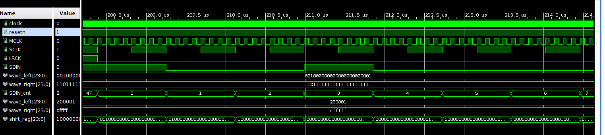

This summer I have been reading a book on VHDL 2008: "Effective Coding with VHDL" from Ricardo Jasinski. Although not for beginners I can recommend this book to anyone with some knowledge of FPGA's and general programming skills. To get some practical experience I obtained two dev kits:  

  * A [Zedboard](https://reference.digilentinc.com/_media/zedboard:zedboard_ug.pdf) dev kit containing an Xilinx Zync 
  * A [Nexys4-DDR](https://reference.digilentinc.com/_media/nexys4-ddr:nexys4ddr_rm.pdf) with Xylinx Artix-7 from Digilent 

Digilent also sells PMOD modules which are extension modules containing specialized IO chips. I bought the [I2S2 DA/AD board](https://reference.digilentinc.com/reference/pmod/pmodi2s2/reference-manual) with I2S interface. It can sample as well as playback audio wave data via a simple I2S protocol. It is based on the [CS4344](https://www.cirrus.com/products/cs4344-45-48/) and CS5343 chips from Cypress. In this article I focus on the CS4344 DA converter.

Using the I2S board is relatively simple when compared with for example the audio chip embedded on the Zedboard. That chip supports a complex signal path with many registers. Setting one of the registers to a wrong value will quickly result in no audio output. Debugging would to take a lot of effort for a first project. The CS4344 however is very simple. It has an I2S interface and no registers to set. Even its datasheet is short :) I can simulate the VHDL on fore hand before flashing and check the output I2S waveform. If that is correct the audio chip will produce sound.

The roadmap of my project is as follows:
  1. First produce a square wave with a specific frequency.
  2. Produce a single sine wave with a specific frequency.
  3. Implement I2S AD reception and loopback to the DA output.
  4. Implement an additive synthesis engine based on a bandwidth enhanced sine model. There is an interesting course on [Coursera](https://www.coursera.org/learn/audio-signal-processing/home/welcome)
  5. Control the synthesis parameters from a soft core.
  6. Run Linux (Yocto) on a soft core and control the synthesis engine with a Linux device driver.

So I have a long way to go. In this article I will focus on step 1.

# I2S

How does I2S work? Have a look at the following schematic:

Note that the CS4344 datasheet uses LRCK as WS and SDIN as SD. Furthermore it uses an extra clock signal MCLK. In my FPGA design I use the Xilinx Clock wizard to generate MCLK. The other signals are generated by the FPGA i2s_sender component introduced in this article.

## parameters

The CS4344 datasheet shows a few examples of different clock parameters.

First I defined a package for some constants:

        package types_pkg is    
            constant MCLK_FREQ : integer := 18432000; in Hz
            -- 48Khz sample rate
            constant LRCK_FREQ : integer := 48000; -- MCLK/384
            --24 bits per LRCK phase (low = left channel, high = right channel_
            constant SCLK_FREQ : integer := LRCK_FREQ*48;
            constant SAMPLE_WIDTH : integer := 24;

            subtype sample_t is signed(SAMPLE_WIDTH-1 downto 0);
        end;

## i2s interface

The interface of the i2s_sender is as follows:

        entity i2s_sender is
            --wave_x_in are sampled at the rising edge of MCLK
            Port ( 
                   resetn : in std_logic;
                   MCLK_in : in std_logic;
                   LRCK_out : out std_logic;
                   SCLK_out : out std_logic;
                   SDIN_out : out std_logic;
                   wave_left_in : in sample_t; 
                   wave_right_in : in sample_t
            );
        end i2s_sender;

The LRCK, SCLK signal and SDIN signals will be fed to the CS4344 chip. The wave_in samples must be generated by some other FPGA component.

Next the logic of the i2s_sender. There are two processes. One process generates the required clocks LRCK and SCLK from MCLK. The other process generates SDIN based on SCLK.

## Generation of the clocks

The clocks are generated by dividing (counting the number edges of) MCLK.

### Clock dividing

For each generated clock (LRCK, SCLK) the value at which the counter should toggle a derived clock is calculated.  The frequency is multiplied by 2 because there are two transition in one clock period. 

    --Change level every _DIV ticks of MCLK
    constant LRCK_DIV : integer := (MCLK_FREQ / (LRCK_FREQ*2)) -1; -- 384/2 -1 = 161
    constant SCLK_DIV : integer := (MCLK_FREQ / (SCLK_FREQ*2)) -1; 

    --types for various counters
    subtype div_LRCK_t  is integer range 0 to LRCK_DIV; 
    subtype div_SCLK_t  is integer range 0 to SCLK_DIV; 
    
    --count the number of MCLK ticks before toggling LRCK    
    signal LRCK_cnt : div_LRCK_t;
    --count the number of MCLK ticks before toggling SCLK
    signal SCLK_cnt : div_SCLK_t;
    
    --count the number of SCLK periods after LRCK went low
    signal SDIN_cnt : integer range 0 to (SAMPLE_WIDTH*2-1);
        
    --wave_x_in are sampled at the rising edge of MCLK
    signal wave_left : sample_t := (others => '0');
    signal wave_right: sample_t := (others => '0');  
          
    signal shift_reg: std_logic_vector(SAMPLE_WIDTH-1 downto 0);

### Counters

The counters are relatively simple. The count up to the divider value and then toggle a clock. Furthermore the moment LRCK toggles is also used to set the position of SDIN to either 0 or SAMPLE_WIDTH (24).

         if MCLK_in'event and MCLK_in = '1' then -- Rising clock edge
            -- MCLK == 18.4320 Mhz
            -- LRCK = MCLK / 384 = 48khz = Fs
            -- SCLK = 48 * Fs = MCLK/8
            if LRCK_cnt = LRCK_DIV then
                LRCK_cnt <=0;
                if LRCK_out = '1' then
                    --falling edge
                    --assert: SCLK will go low
                    LRCK_out <= '0';
                    SDIN_cnt <= 0;
                else
                    -- rising edge
                    --assert: SCLK will go low
                    LRCK_out <= '1';
                    SDIN_cnt <= SAMPLE_WIDTH;
                end if;
            else
                if (SCLK_cnt = SCLK_DIV) and (SCLK_out='1') then
                    --SCLK will go low
                    SDIN_cnt <= SDIN_cnt + 1;
                end if;                            
                LRCK_cnt <= LRCK_cnt + 1;  
            end if;
            
            if SCLK_cnt = SCLK_DIV then
                SCLK_cnt <=0;
                SCLK_out <= not SCLK_out;
            else
                SCLK_cnt <= SCLK_cnt + 1;  
            end if;

## Generation of the SDIN signal

The SDIN signal contains the bits of the input wave signal. One bit is shifted out every SCLK clock. The left sample should be shifted out when LRCK is low. The right sample is shifted out when LRCK is high. A first approach was to create a process that acts both on the rising edge of LRCK as well as the falling edge. This doesn't work however as flip flops which are used to implement the design cannot trigger on both clock edges. As a solution I now count the number of SCLK clocks after the falling edge of LRCK. 

  * SCLK_cnt = 1..25 outputs the left sample
  * SCLK_cnt = 25..48 outputs the right sample
  * The last bit of the right channel sample is shifted out at SCLK_cnt=0
  * The shifted out bit is sampled by the CS4344 at the rising edge of SCLK

        if SCLK_out'event and SCLK_out = '0' then -- Falling clock edge                
                if SDIN_cnt=0 then
                    -- load shift register
                    shift_reg <= std_logic_vector(wave_left); 
                elsif SDIN_cnt=24 then
                    shift_reg <= std_logic_vector(wave_right);
                else 
                    shift_reg <= shift_reg(shift_reg'HIGH-1 downto 0) & '0';
                end if;
                SDIN_out <= shift_reg(shift_reg'HIGH);
        end if;

## Top level component

For testing the top level component connects a square waveform generator to the i2s_sender. The i2s_sender output is connected to the FPGA output pins. If the PMOD modules is plugged into the JA port. The following contraints can be used for the Nexys 4 DDR dev kit.

  set_property -dict {PACKAGE_PIN C17 IOSTANDARD LVCMOS33} [get_ports MCLK_out]
  set_property -dict {PACKAGE_PIN D18 IOSTANDARD LVCMOS33} [get_ports LRCK_out]
  set_property -dict {PACKAGE_PIN E18 IOSTANDARD LVCMOS33} [get_ports SCLK_out]
  set_property -dict {PACKAGE_PIN G17 IOSTANDARD LVCMOS33} [get_ports SDIN_out]

## Debugging

During simulation it is helpfull to print out all the calculated values to make sure that they are correct. It is also possible to view them in Vivado simulation objects pane. I added the following to i2s_sender to print out the values.
    
    debug : process (dummy) is
    begin
        --print the dividers when in simulation mode
        report "MCLK_FREQ hz " & integer'image(MCLK_FREQ);
        report "LRCK_FREQ hz " & integer'image(LRCK_FREQ);
        report "SCLK_FREQ hz " & integer'image(SCLK_FREQ);
        report "SAMPLE_WIDTH " & integer'image(SAMPLE_WIDTH);

        report "LRCK_DIV" & integer'image(LRCK_DIV);
        report "SCLK_DIV" & integer'image(SCLK_DIV);
    end process;

During development at some point the simulation signal output seemed correct. However after synthesis no audio was output. A first debug approach was to count the number of eg. SCLK edges and connect that counter to the LEDs of the development kit. By setting the width of the counter correctly and displaying the most significant bits of the counter I was able to check if for example LRCK was indeed toggling at 48 kHz. 

Another approach is to add an ILA debug core to your design and connect the output pins of the designed component to the debug core. This way you can see if the synthesized design on the FPGA behaves as expected.

In order to test the component I created a simple square waveform generator that generates a left channel signal at 440 Hz and a right channel signal at 880 Hz. This generator was hooked up to the i2s_sender.

    resetn <= '0', '1' after 100ns;
    clock <= not clock after 10 ns;
    MCLK <= not MCLK after 54.253472222222 ns; -- 18.4320 Mhz
    
    sqwv : entity work.square_wave
        port map (
         resetn => resetn,
         MCLK_in => MCLK,
         wave_left_out => wave_left,
         wave_right_out => wave_right
        );
             
    i2s : entity work.i2s_sender
            port map (
            MCLK_in => MCLK,
            resetn => resetn,
            LRCK_out => LRCK,
            SCLK_out => SCLK,
            SDIN_out => SDIN,
            wave_left_in => wave_left,
            wave_right_in => wave_right
            );    

Below outputs of the I2S waveform at the start of a new LRCK cycle (left channel) 

Below outputs of the I2S waveform at the start of the rising edge of LRCK (right channel).

# Conclusion

Some things I noticed while experimenting with VHDL 2008 and Xilinx Vivado:
  * Lack of support of some VHDL 2008 features in Vivado.
  * Vivado spews out a large number of warnings. It's not easy to see which warnings are important and which are not.
  * Eventhough simulation is running fine the synthesized result can still be wrong.
  * The Cypress CS4344 datasheet's I2S waveform specification is not very clear. It does not show that the last bit of the previous sample is clocked in at the first rising SCLK after LRCK phase change.

The files are available on my github page. Version Control with Vivado is not trivial. I used [this approach](https://github.com/barbedo/vivado-git) to handle version control.

